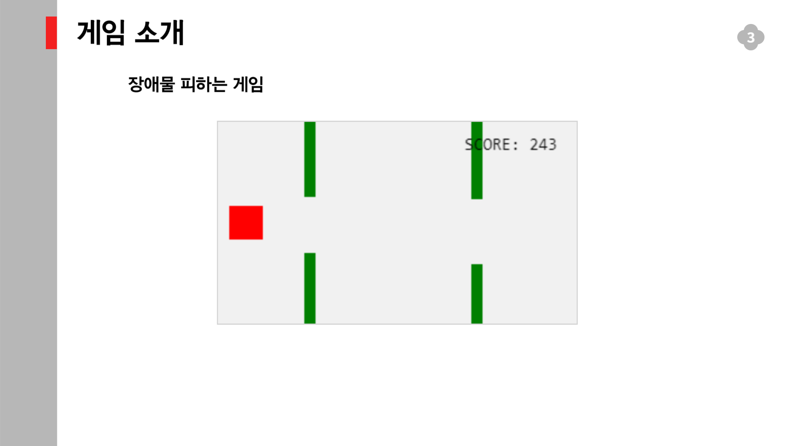

## 10주차 코드 리뷰 발표 내용

https://www.w3schools.com/ 사이트의 html game example 게임 코드 분석 및 리뷰

meta 태그부터 분석 시

MyGameArea 객체 분석

function component 분석 ( ES6 문법 X ) 

충돌감지 코드 분석

충돌감지 코드 분석 이해를 돕기 위한 그림

updateGameArea 함수 분석 

Script의 끝 , 버튼 태그의 속성 의미 분석

