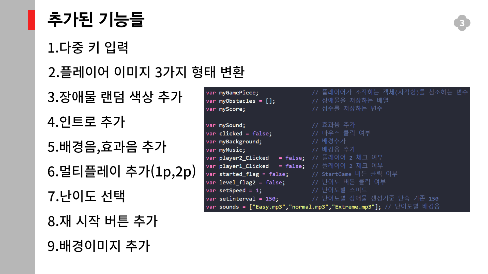
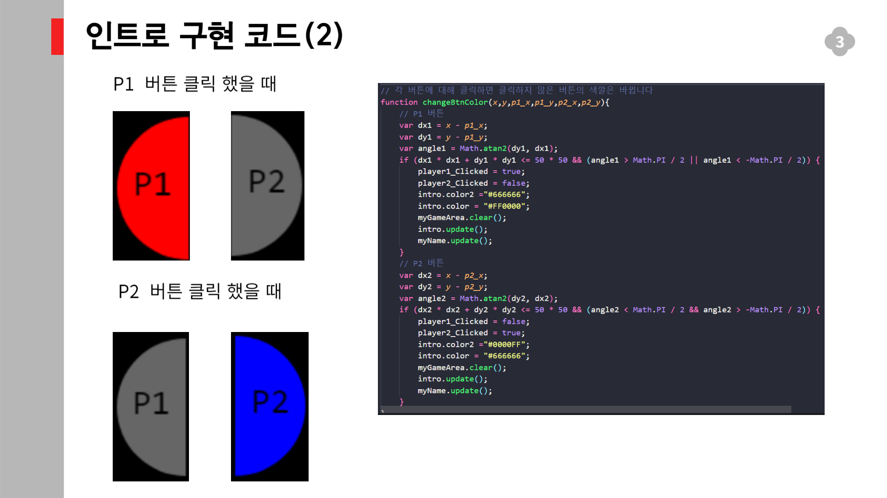
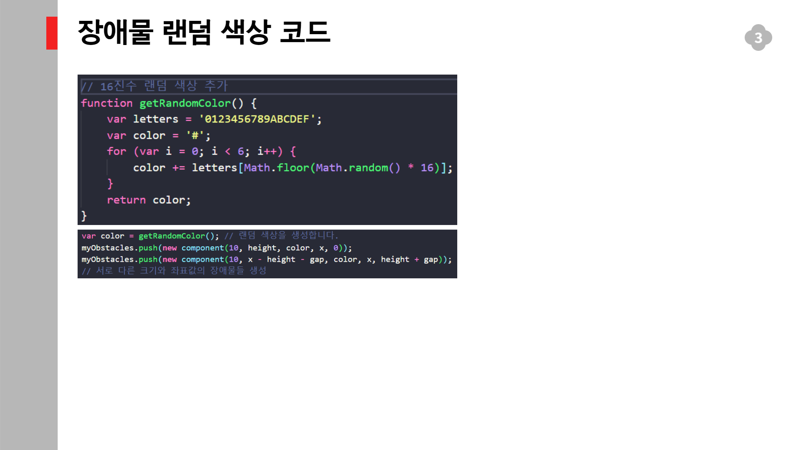

## 11주차 html game upgrade 발표 내용 

이전에 분석한 html game을 upgrade를 해보았습니다

추가된 기능은 총 9가지입니다

각 기능별로 추가 설명입니다

인트로를 구현하기 위한 과정의 사진 3개 입니다

다중 키 입력을 받고 특정키에 해당에는 조건문을 추가하였습니다

16진수를 랜덤으로 만들어서 적용했습니다

난이도별로 게임의 속도감,배경음이 달라집니다

재시작 버튼을 감췄다 공개하는 식으로 했습니다 

