## 14주차 유니티 게임 업그레이드 및 깃허브 정리 발표 

여태 정리했던 게임프로그래밍 과목의 깃허브 레포지토리의 내용입니다 
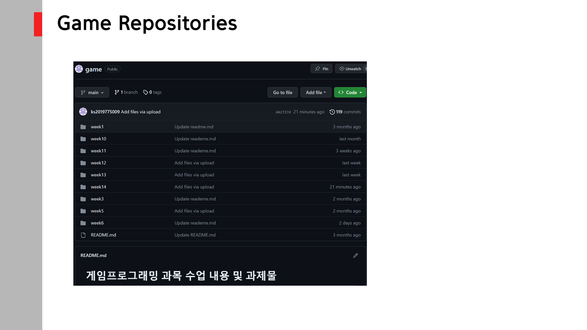

각 디렉토리별 히스토리입니다
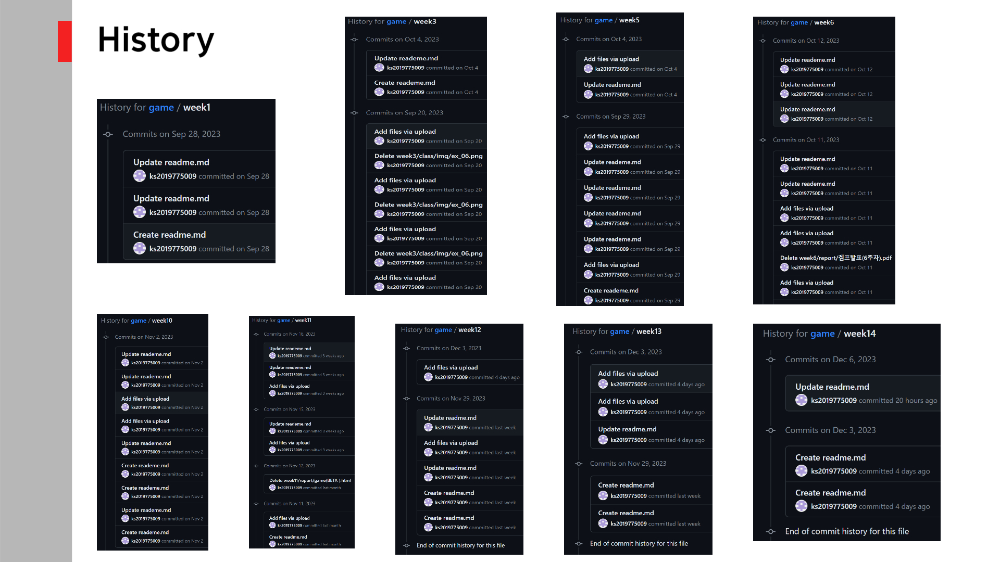
각 디렉토리별 Rademe.md 파일들입니다
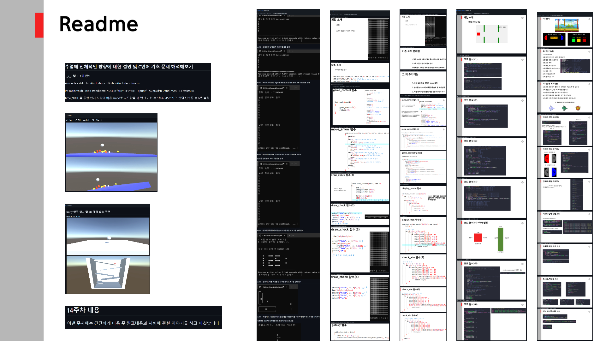

기존 게임을 업그레이드 했던 결과물들입니다
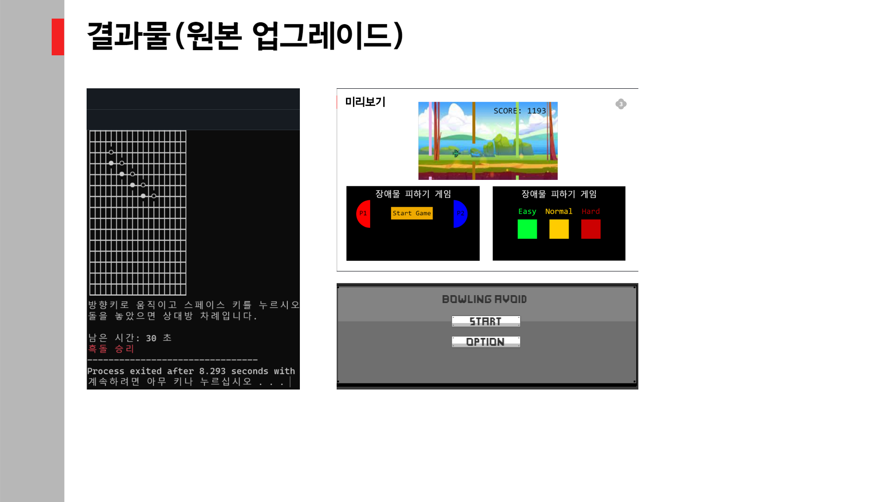
원본게임 출처와 소개입니다 
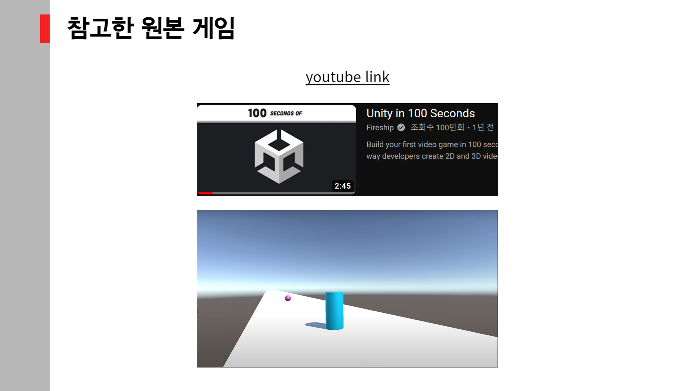
제가 업그레이드를 한 기능들입니다
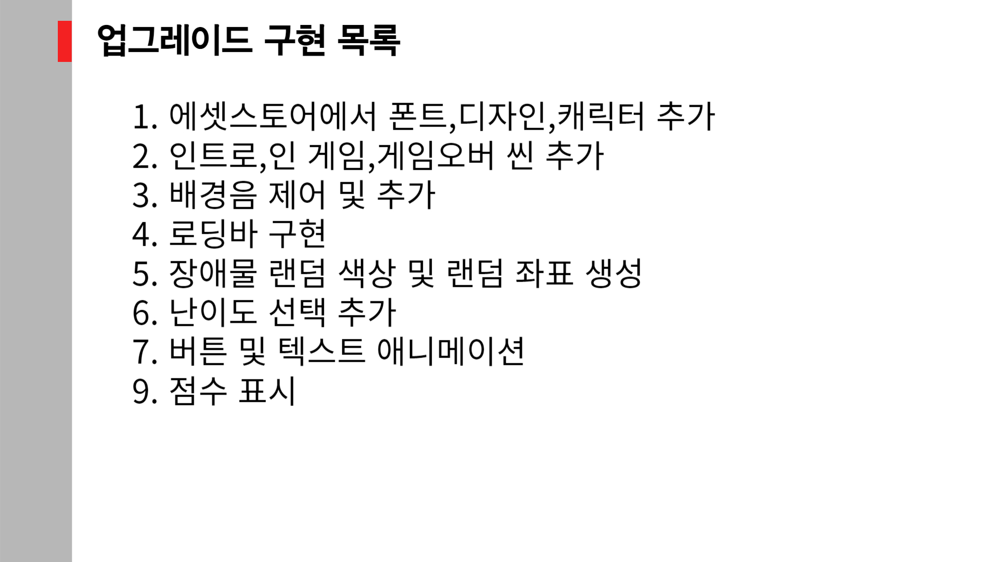
에셋스토어에서 다운받은 목록입니다
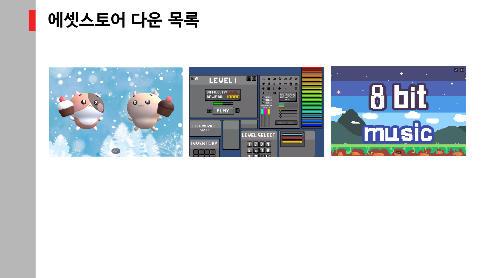
사운드를 생성하고 제어했던 코드들입니다 (총 2개의 스크립트)
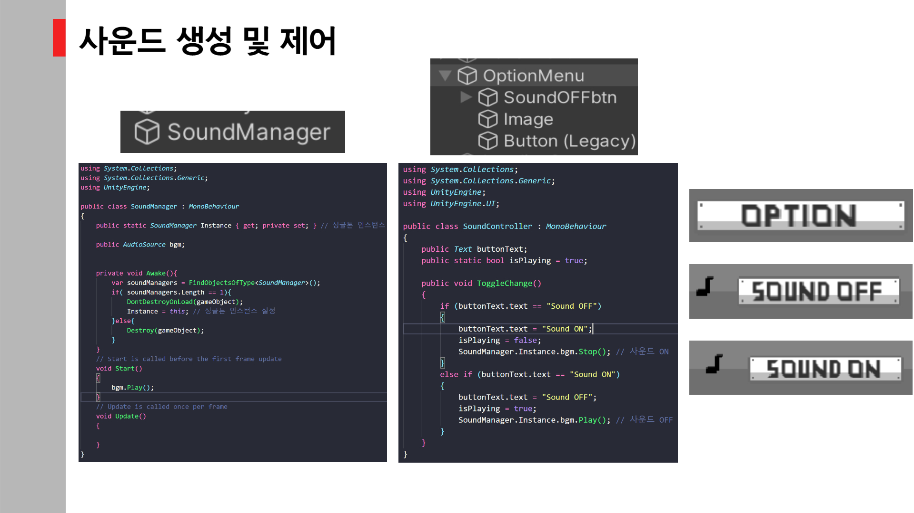
로딩화면을 구성한 코드입니다
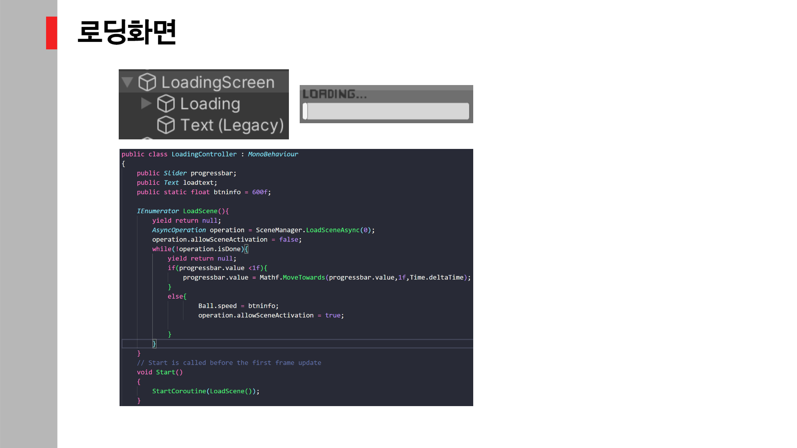
난이도 선택 화면을 구성한 코드입니다
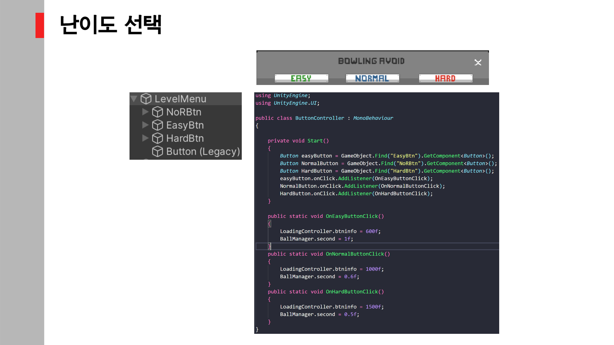

장애물의 생성,속성,색상,좌표을 구성한 코드들입니다 (총 2개의 스크립트)
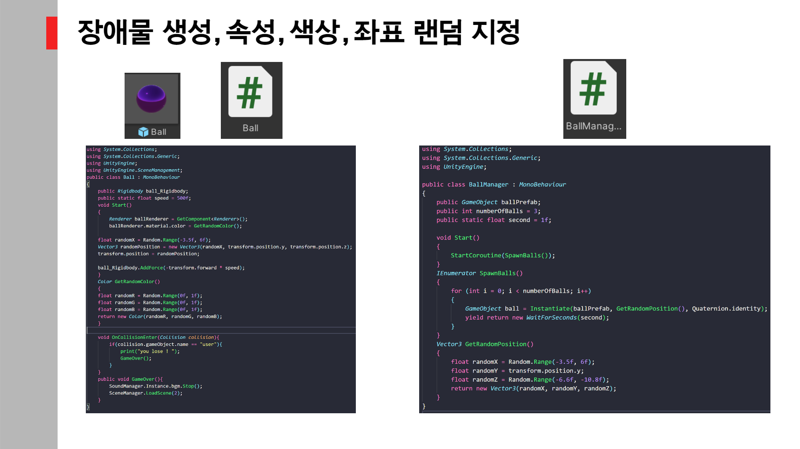

나머지 구현은 유니티 게임엔진을 실행시켜서 실습을 통해 확인하였습니다
