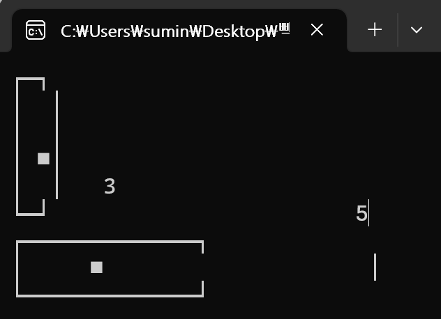

## 높은단위 단계 출력 프로그램 실행 결과

## 낮은단위 단계 출력 프로그램 실행 결과

## 라이브러리 함수 log10을 통한 높,낮은 단위 출력 프로그램 실행 결과

## 나머지 연산자를 이용하여 10으로 나눈 나머지를 이용한
   높,낮은 단위 출력 프로그램 실행 결과

## 입력된 정수를 디지털 숫자로 표현하는 프로그램 실행 결과

## 슬라이드바를 이용한 수직 수평제어 프로그램 실행 결과

## 화면에 표시된 임의의 도형을 화살표(방향)키를 이용하여 연속적으로 이동시키거나
시계방향 또는 반 시계방향으로 회전시키는 프로그램

