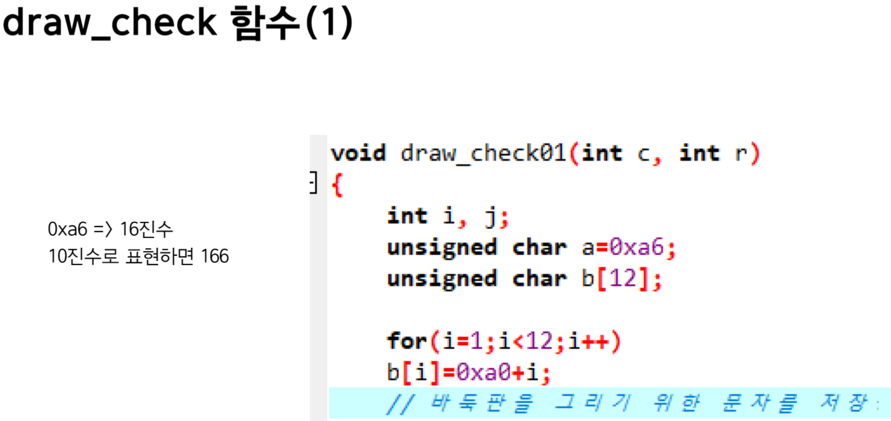

## 게임프로그래밍 2번쨰 발표 내용
# 코드 분석 및 해석
#( 맡은 주제 : 오목게임을 위한 바둑판, 바둑돌 구현 소스 분석 )

#오목게임을 위한 기초가 되는 코드입니다

#사용된 4개의 핵심 함수입니다

#메인함수와 컨트롤함수입니다
- draw함수호출과 바둑돌위치 및 사용자의 입력을 받아 move_arrow
- 함수 호출을 하고있습니다

#방향키로 입력받아 바둑돌의 위치를 옮기는 함수입니다

# 바둑판을 그리기 위한 특수문자들을 초기화합니다.

# 바둑판 상단의 가로줄을 생성합니다.

#바둑판 좌측,중간,우측줄을 생성합니다.

#바둑판 하단의 줄을 생성합니다.

#파라미터로 좌표값을 받아 커서위치를 옮기는 함수입니다.

