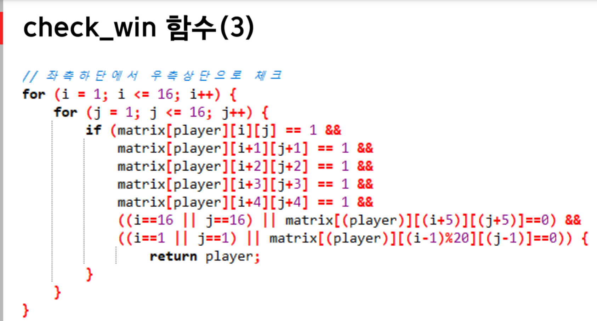

## 게임프로그래밍 6주차 발표 내용

주제 : 기존코드 응용8_1_1을 upgrade(컴퓨터 자원 활용)

저번 발표는 오목게임을 위한 기초가 되는 코드였다면
이번 발표는 오목게임을 완성 한 다음 컴퓨터 자원을 활용합니다

기존 코드의 문제점을 해결했습니다.

컴퓨터 자원을 활용하여 3가지 기능을 추가하였습니다.

- 그 외 업그레이드 내용
  흰돌을 추가하고 바둑돌을 놓을 떄 마다 차례가 넘어가도록 구현

game_control 함수의 바뀐점 

추가된 display_stone 함수

추가된 checkwin 함수

     

